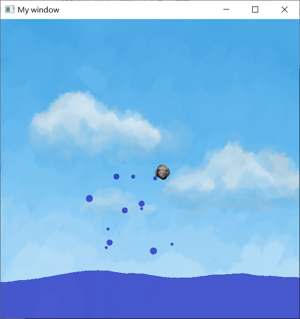

# Water Simulating With OpenGL

## Introduction

- **方向键 Up** 拨水
- **mouse right press** 拨水
- **mouse left press** 放石头

## Water Effects

- 水波
- 石头撞击水面触发浪花
- metaball模拟浪花

## Detail

**水波模拟**，将水波看成很多弹簧，每个弹簧会和周围的水柱作用，影响彼此的速度，并且给一个速度衰减。

**石头**，在水面上方自由落体，触碰到水面因为冲击力减速，在水中可以看到水和石头blend效果

**水滴**，使用metaball技术，水滴之间距离很近时有融合效果。生成水滴的速度取决于石头撞击水面的速度，当水滴落回水中时消失

**Background**，纹理贴图

>  [github](https://github.com/Anlarry/water_effect)

